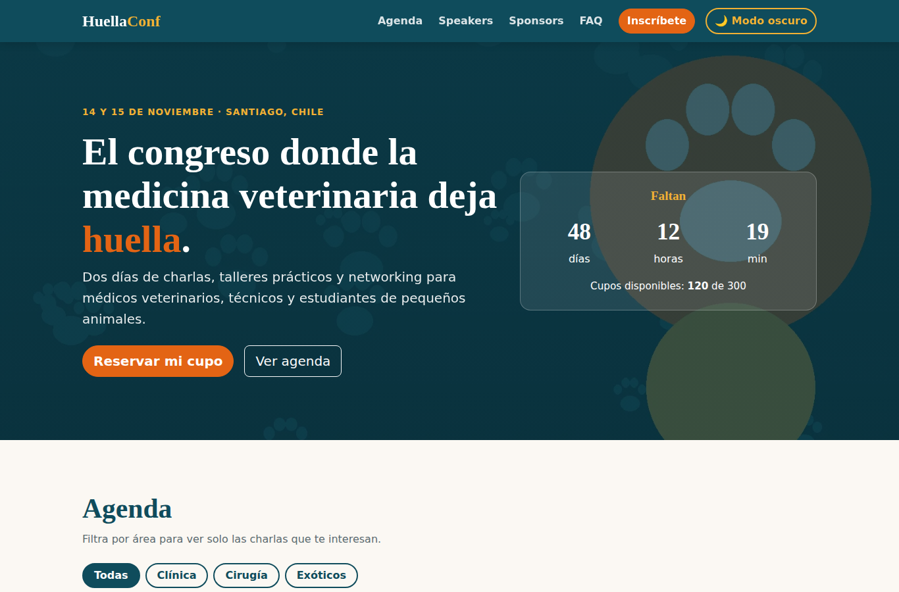
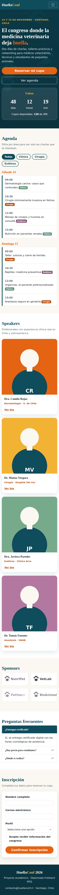

# HuellaConf 2026 🐾

> Proyecto del Módulo 1 — HTML + CSS + JS · Diplomado Fullstack IPSS
> Opción base: **C — Página de evento/conferencia**

## Integrantes

- Sebastián Enrique

## Descripción

HuellaConf 2026 es la landing de un congreso ficticio de medicina veterinaria de pequeños animales en Santiago.
Incluye hero con cuenta regresiva, agenda filtrable por área, speakers, sponsors, preguntas frecuentes e inscripción con validación en tiempo real.

## Demo

- Sitio desplegado: https://sebastianespinozam.github.io/huellaconf/
- Capturas:

| Desktop | Mobile |
|---|---|
|  |  |

## Cómo correr localmente

```bash
git clone https://github.com/SebastianEspinozaM/huellaconf.git
cd huellaconf
# Abrir index.html en el navegador
# O con un servidor:
python3 -m http.server 8000
```

## Estructura del proyecto

```
.
├── index.html
├── css/
│   └── custom.css   ← CSS propio, cargado DESPUÉS de Bootstrap
├── js/
│   └── main.js      ← Eventos y JS propio
├── img/             ← Imágenes en WebP
└── docs/            ← Capturas para el README
```

## Funcionalidades

**Componentes Bootstrap:** navbar, card, accordion, modal, list-group, badge y formularios.

**Eventos JS propios (`addEventListener`):**

1. Toggle de modo claro/oscuro (recuerda la preferencia).
2. Filtro de la agenda por área (Clínica, Cirugía, Exóticos).
3. Mostrar/ocultar la bio de cada speaker.
4. Validación del formulario en tiempo real.
5. Envío del formulario: abre un modal personalizado y descuenta un cupo disponible.

Además, una cuenta regresiva al evento se actualiza automáticamente.

## Stack

- HTML5 semántico
- Bootstrap 5.3 (vía CDN)
- CSS custom propio (variables de paleta y tipografía, mobile first)
- Google Fonts: Fraunces + Nunito
- JavaScript vanilla
